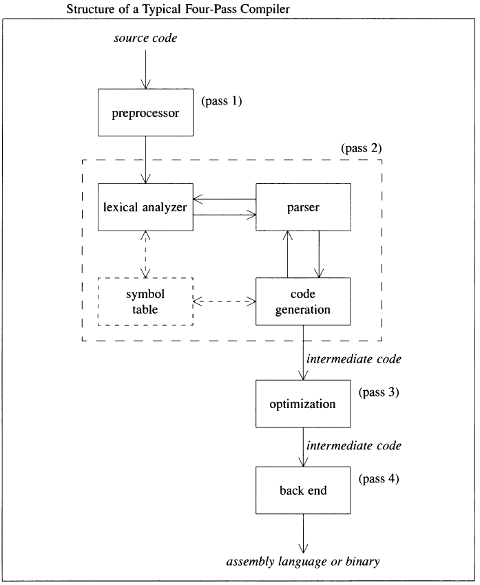

# Meo sub-C compiler

## Let's start
- **meo** is :cat: in Vietnamese, but now  it is sub-c compliler
- The project is mainly used to study compliler.
- I used #100DaysOfCode strategy, that will make small step everyday by [rule](https://github.com/kallaway/100-days-of-code/blob/master/rules.md)
- I start by following to [A Compiler Writing Journey](https://github.com/DoctorWkt/acwj)

## Milestone
- [ ] Running basic math operator +,-,*,/ on X86_64 GNU/Linux
- [ ] Update later ...

## Design
- Using design as four-pass compiler, which is refered from [Compiler design in C - Allen I.Holub](https://holub.com/goodies/compiler/compilerDesignInC.pdf)
- Each module lexical analyzer, parser, code generation are designed as independent module, it can be easy to replace without any effect other part.
- 

## Implementation
- Only supporting X86-64 and optimization is not considered at first step.
- Using back end of GCC to generate executed code.
- Using TDD with [catch2](https://github.com/catchorg/Catch2).
- Using [Google coding convention](https://google.github.io/styleguide/cppguide.html).
